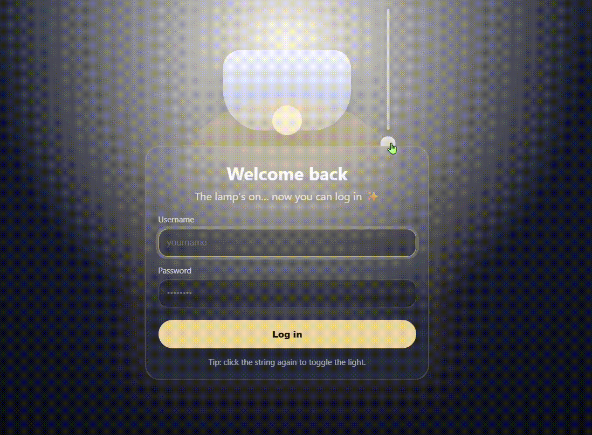

# Lamp-Toggle-Login UI

This project is a creative login interface built with HTML, CSS, and JavaScript.

Pulling the lamp cord turns the light on and reveals the login form with a glowing animation effect. Pulling it again turns the light off and hides the form.

## Features
- Interactive lamp cord toggle
- Animated light and glow effects
- Login form appears when the lamp turns on
- Smooth UI transitions
- Keyboard accessibility support

## Technologies Used
- HTML
- CSS
- JavaScript

## Preview

